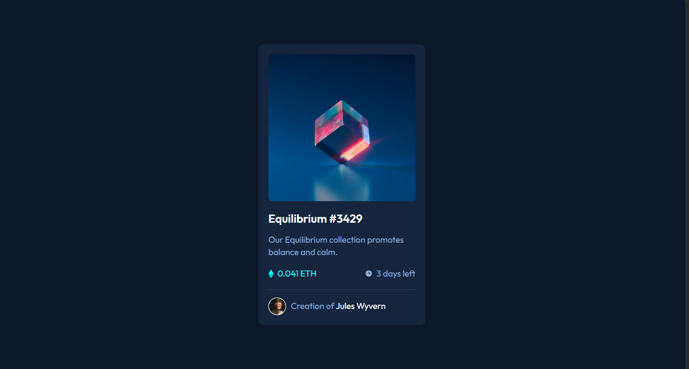
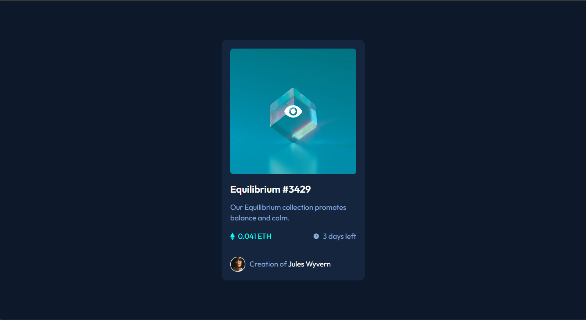
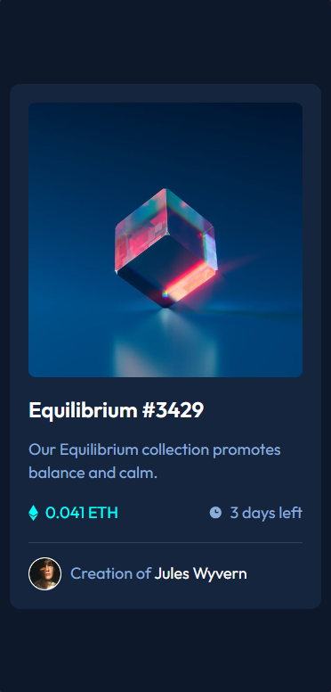

# Frontend Mentor - NFT preview card component solution

This is a solution to the [NFT preview card component challenge on Frontend Mentor](https://www.frontendmentor.io/challenges/nft-preview-card-component-SbdUL_w0U). Frontend Mentor challenges help you improve your coding skills by building realistic projects. 

## Table of contents

- [Overview](#overview)
  - [The challenge](#the-challenge)
  - [Screenshot](#screenshot)
  - [Links](#links)
- [My process](#my-process)
  - [Built with](#built-with)
  - [What I learned](#what-i-learned)
- [Author](#author)

**Note: Delete this note and update the table of contents based on what sections you keep.**

## Overview

Greetings fellow programmers, I present my implementation of the NFT preview card challenge on Frontend Mentor. I eagerly seek your constructive feedback on the project.

### The challenge

Users should be able to:

- View the optimal layout depending on their device's screen size
- See hover states for interactive elements

### Screenshot

### Links

- [Solution URL](https://github.com/HosseinHeydarpour/nftpreviewcard)
- [Live site URL](https://hosseinheydarpour.github.io/nftpreviewcard/)

## My process
To achieve better code organization and a well-structured layout, I employed SASS and flexbox for this project.

### Built with

- Semantic HTML5 markup
- CSS custom properties
- Flexbox
- Desktop-first workflow

### What I learned
Adding the cyan layer and the eye icon was a fun challenge that made me feel good. It was cool to solve a problem and learn new things.

## Author

- Frontend Mentor - [@HosseinHeydarpour](https://www.frontendmentor.io/profile/HosseinHeydarpour)
- Linkedin - [@hosseinheydarpour](https://www.linkedin.com/in/hosseinheydarpour/)

